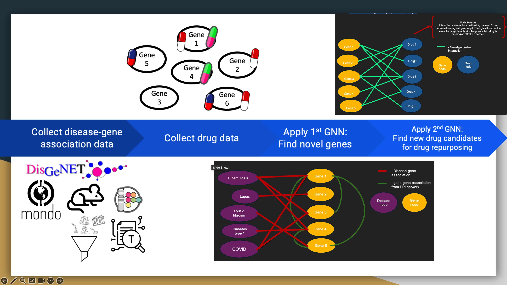

```{r setup, include=FALSE}
knitr::opts_chunk$set(echo = TRUE)
```


# Introduction

- Working on Masters in Biomedical Sciences and Biotechnology AKA BSBT Program
- Discovered a passion in computing. 
- With some familiarization in the field through classes I decided to apply it.

```{r}
knitr::include_graphics(c("images/jravilab.png", "images/jravilab_log.png"))
```


### Past Project
Question: Can we use computational methods and public large-scale disease-gene
association data to find novel genes that may play a role in the host response of
a specific disease and can we find new drug targets for these new and known genes?

### What did I use in my past project?
- My project involved using a public dataset from DisGeNET, ontology, and 
machine learning to achieve two things

1. discover potential novel genes related to a specific disease
that can later be verified in a wet lab. 
2. apply currently FDA approved drug data to novel and known genes of many diseases to see 
if we can repurpose them for other diseases disease. 


### Why TB?
- Tuberculosis is considered a serious threat level in anti-microbial resistance
(AMR).
- AMR is when bacteria, viruses, fungi and parasites change over time and no 
longer respond to medicines making infections harder to treat and increasing the
risk of disease spread, severe illness and death. 
- The main players are known as the ESKAPE pathogens but TB is not far behind them.
- 1 in 3 deaths from AMR are caused by drug resistant TB.

```{r}

```


- But the biggest motivation outside of all the stats and world impact is there just isn't enough data for some diseases.
- Many infectious diseases had a lower count of host disesae-gene associations compared to complex diseases like COPD and Pneumonia.
- Thus finding computational methods that can help us discover potential novel disease-gene associations for diseases such as TB we can help
expand the pool of drug targets.

```{r}

```

### Current Project
```{r}

```


